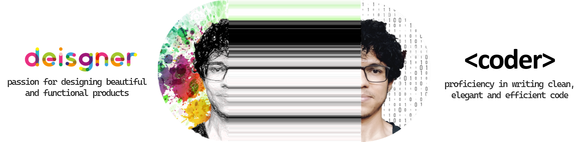

  

Hi, I'm Atharva Marathe, currently enrolled as a senior pursuing an undergraduate degree in CSE. When I'm not coding, yelling "It worked !!" or swearing at computer, you'll find me cooking, reading or working out.
  

## About me
I'm curious about things and enjoy learning. I love to explore new domains and territories and don't fixate myself to any certain technology. That's why it's easy to adapt and learn new things with strong basics foundation.
  

## Showcase

  
  
   

  <i>These demos are real, you can click them! They will take you to the respective projects.</i>

## How I work
I'm detail-oriented and commited to projects I work on. I like problem-solving and fixing bugs. I like to keep my tasks organized to maintain productivity and help streamline my goals.
  

## Get in touch
Drop an <a href="mailto:atharvamarathe@outlook.com">email</a> 
Connect with <a href="https://www.linkedin.com/in/atharva-marathe/">me</a> on LinkedIn
  

